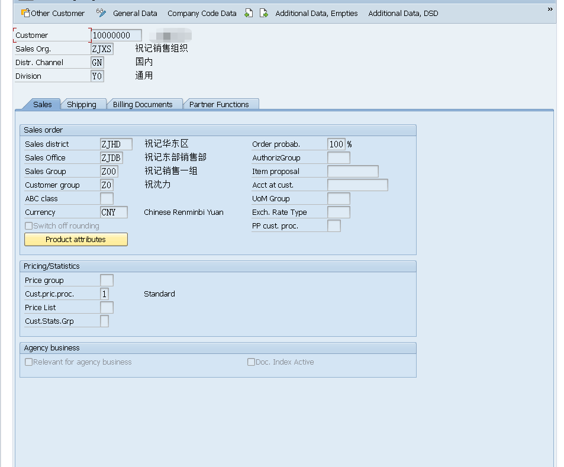
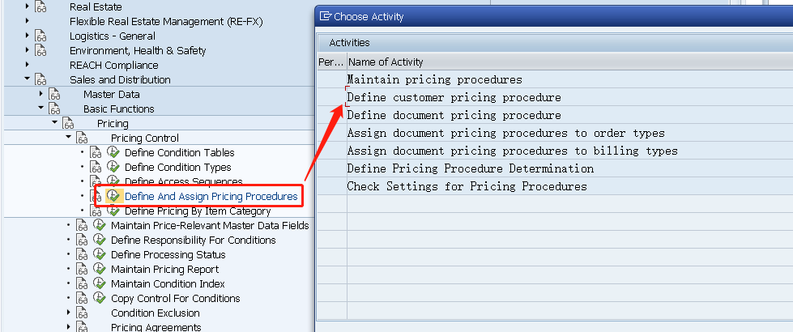
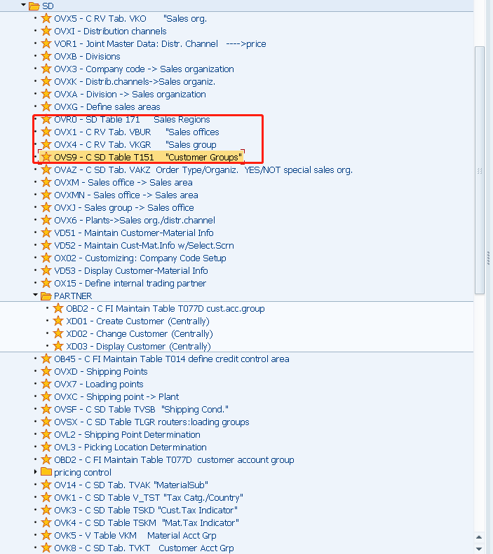
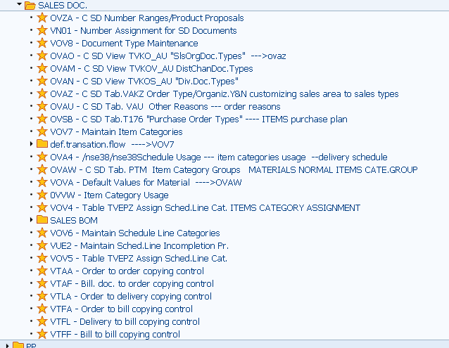

#### 20210606 客户主数据及销售凭证相关

本周在测试机上已经完成了基础的客户主数据的建立及凭证类型的创建.

客户主数据包括一般数据,公司数据,销售数据以及附加的几个,这里涉及到[DSD](https://blogs.sap.com/2008/02/26/understanding-dsd-in-sales-and-logistics/)相关的内容,附加视图可以进行个性化设置.

公司数据主要涉及到统驭科目和排序码,必填,否则开票的时候会遇到麻烦(若没有公司视图,但有销售视图业务还是可以做,但过账会出错)

销售数据关联的比较多,销售区域数据和定价过程,销售区域中销售办公室和销售组和销售组织关联的比较紧,整个的配置设计可以灵活设计,譬如我公司用的按照各个地区,然后省,市,最后用客户组来区分各个分公司,我在测试机上的区分换了另外一种方式,主要是我自己看着直观些,前者通过集团层面对每个地区进行划分最后由客户组进行归集客户属于哪家公司的销售,通过客户组进行权限管控,我这种按照片区划分,主要是为了看着舒服,适用范围比较狭窄.

然后客户定价部分,需要注意定价是一个非常复杂的过程,通过不同组合得到的定价完全不同,涉及到组合我觉得自己无法完全说清楚,但以后随着逐渐深入再逐个进行总结,这里的客户定价过程是非常重要的,这个1会和凭证定价过程以及销售组织组合确定一张销售订单的定价过程,配置如下图中配置.

其他配置如下图,其中OBD2还可以控制客户视图的显示设置

然后就是开票部分的含税与否还有它的账期设置,如果有跟单员和销售雇员还要配置或者伙伴的确认过程来配置

emmm,发现做小结是一个需要非常需要耐心的,太花时间了,今天就做到这里吧,sap的总结不仅涉及范围广而且涉及的面还很多!

这种小结主要是为了给自己留下一点痕迹,知道自己在干什么,又干了什么,进度如何.

简而言之,这周我在测试机上做了客户数据部分,销售凭证(销售凭证,行项目类别,计划行类别)以及其复制控制部分,以及部分的移动类型,为何要做移动类型的学习,因为在计划行类别里会涉及到移动类型的交货部分的定义,针对不同的订单定义不同的交货类型,以及出发什么样的后续操作,譬如我要外购,这里可以触发一个采购申请什么的进入到MM模块.还有关于请求装配什么的应该会将标签带入PP模块,对于这里的事务流没有进行更深的学习.

#### ####说明

因为配置多次,发现自己写的这个文档是有问题的,有点思路不清晰,但按照目录顺序来梳理整个模块的结构基本没错,TCODE也都整理出来了,更全更详细的等月底把SD业务配好后再重新整理更新.